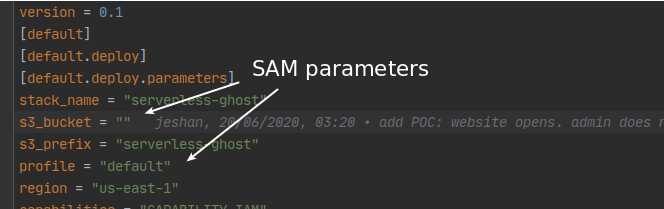

# Deployment instructions

## TLDR
- Put your desired `DomainName` and deployment bucket `s3_bucket` in [samconfig.toml](samconfig.toml)
- Run `docker-compose up deploy`
- Check output for how to validate your SSL certificate.
- Put the stack output `WebsiteDns` as CNAME in your dns settings
- Hit the `PingUrl` given in the stack output
- Access the blog at `https://${DomainName}`

## The details
You really need [Docker](https://docs.docker.com/get-docker/) to deploy this project. This is because Ghost release versions are already available as Docker images, relieving us of maintaining a separate fork for it in this repository.

Also, [Docker Compose](https://docs.docker.com/compose/install/) makes some commands a bit simpler.

The deployment process uses AWS SAM CLI behind the scenes.
It needs a bucket where code artefacts and Cloudformation templates are deployed. Specify it under `s3_bucket` in [samconfig.toml](samconfig.toml).

> Otherwise, let sam create one for you as [described here](https://aws.amazon.com/blogs/compute/a-simpler-deployment-experience-with-aws-sam-cli/).

`serverless-ghost` CloudFormation parameters are to be declared here:

Next, you need a domain name where the blog will be reachable, e.g `ghost.johnnyserverless.com`. Declare it where `DomainName` is indicated in `samconfig.toml`. This will become the Api Gateway domain behind which the serverless function will be reachable.
> If you're thinking of skipping step by hitting the url provided by Api Gateway, you will see many Ghost routes return 404. I could fix it but I'm too lazy to go patch the Ghost code.

Next, run the deployment command:

`docker-compose up --build deploy`

This should go smoothly assuming you have the proper permissions. This process will create many resources, including:
- A Certificate Manager ssl certificate.
> You need to check the deployment output on how to validate it by DNS validation. Deployment will not complete unless you do this
- A VPC specific to `serverless-ghost`.
> That's mostly to simplify deployment and you could replace it with your own.
- An IAM access key for a new user
> It will be used by S3 and SES.

It will also create a CloudFront distribution and do many other things, including configure Ghost to use the various AWS services.

## Cold start
After first deployment, we need to let Ghost do its initialisation, e.g copy themes and populate the database. To do so, hit the ping url given in the cfn output,

e.g run

`curl  https://ghost.johnnyserverless.com/ghost/api/v3/admin/site/`

Give it about 1 minute to run __even__ if the request times out. Initialisation is still going on.
Try again in a few seconds.
When all is done, you should be able to use the blog properly at your configured domain:

## Additional deployment instructions
> I've tried to optimise the defaults for fast stack creation and/or create cheap resources. The process is not designed to be as flexible as possible. e.g allocating specific amount of storage is not parameterised. You need to modify the [template.yaml](template.yaml) if you want more specific customisations.

You can change AWS cli profile used by SAM by setting the `profile` key in `samconfig.toml`.

### Internet access
You will need a NAT gateway for outbound traffic, e.g for Ghost to send forgot password emails. Since NAT gateways are expensive to run, the default here is to not create it. To do so, set the `EnableNat` parameter to be `true`. 

### Emails
`serverless-ghost` provides support for email (only) via Amazon SES.
To enable SES, you need to provide `SesSmtpPassword`. You need to generate that password from the created IAM user's secret access key.
- Uncomment the `SecretAccessKey` [template](template.yaml) output here:
- Redeploy the stack to get the said value: `docker-compose up --build deploy`
- Paste that value in [docker-compose.yml](docker-compose.yml) here:

- Run `docker-compose up smtp-password`
- Check the output for the smtp password:

- Put this value as `SesSmtpPassword` parameter:
  

Other parameters to be aware of:
- `DatabasePassword`: Please set a more reasonable one than the default!
- `EnableDebugLogs`: ensure it's true so that you can attach the logs when reporting issues.
- `SentryDsn`: If you like to [use Sentry](https://sentry.io/welcome) for error monitoring.
- `Memory`: Number of megabytes to allocate to the serverless function. It will mostly help just to reduce cold start times.
- `UseServerlessDb`: Uses an Aurora serverless database if `true`. Otherwise, it uses an RDS Mysql `db.t3.micro`

> Feel free to edit [template.yaml](template.yaml) for more flexibility.

# Licensing
Custom code provided in this repository is released under the [Simplified BSD Licence](LICENCE).

This project includes code Copyright 2017 Amazon.com, Inc. or its affiliates. All Rights Reserved. See [LICENCE-SAMPLECODE](LICENCE-SAMPLECODE) for details.

The [index.js](index.js) is taken from the upstream project and is Copyright (c) 2013-2020 Ghost Foundation. See [LICENCE-Ghost](LICENCE-Ghost) for details.
