`serverless-ghost` essentially runs as a monolith on a single Lambda function (aka "Lambdalith" :grimacing: )

### First things first
You need [Docker](https://docs.docker.com/get-docker/) to package and deploy this project. This is because Ghost release versions are already available as Docker images, relieving us of maintaining a separate fork for it in this repository. Here, we can just take its contents and package the Lambda code out of it.

Also, [Docker Compose](https://docs.docker.com/compose/install/) is recommended to make some commands a bit simpler.

### Orchestration
The deployment process uses AWS SAM CLI behind the scenes.

`serverless-ghost` CloudFormation parameters are to be declared here:
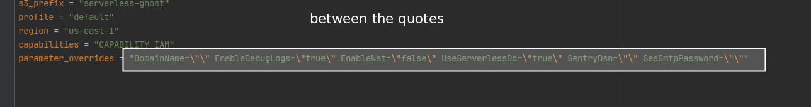

Next, you need a domain name where the blog will be reachable, e.g `ghost.johnnyserverless.com`. Declare it where `DomainName` is indicated in `samconfig.toml`. This will become the Api Gateway domain behind which the serverless function will be reachable.
> If you're thinking of skipping step by hitting the url provided by Api Gateway, you will see many Ghost routes return 404. I could fix it but I'm too lazy to go patch the Ghost code.

Next, run the deployment command:

`docker-compose up --build deploy`

Confirm intended params are being picked up by SAM:

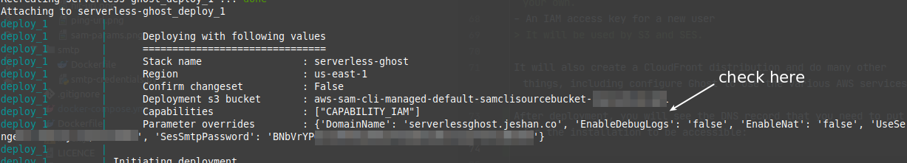

This should go smoothly assuming you have the proper permissions. This process will create many resources, including:
- A Certificate Manager ssl certificate.
> You need to check the deployment output on how to validate it by DNS validation. Deployment will not complete unless you do this
- A VPC specific to `serverless-ghost`.
> That's mostly to simplify deployment and you could replace it with your own.
- An IAM access key for a new user
> It will be used by S3 and SES.

We could visualise the deployment stack as follows:

It contains a nested stack for the VPC which looks something like:

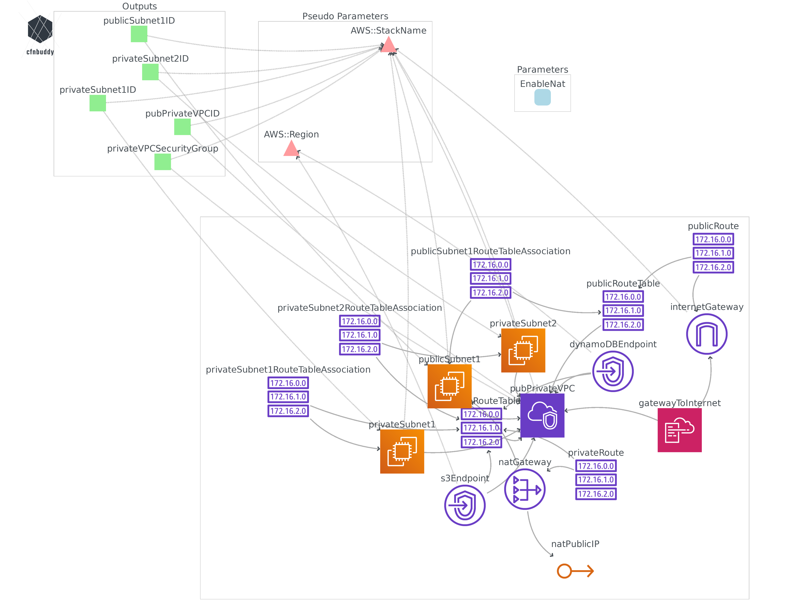

It will also create a CloudFront distribution and do many other things, including configure Ghost to use the various AWS services.

The first deployment should be doable within 10 minutes. After deployment, you will see the DNS record that you need to put for the installation to be accessible:

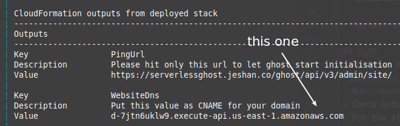

Put this for the domain at your registrar:
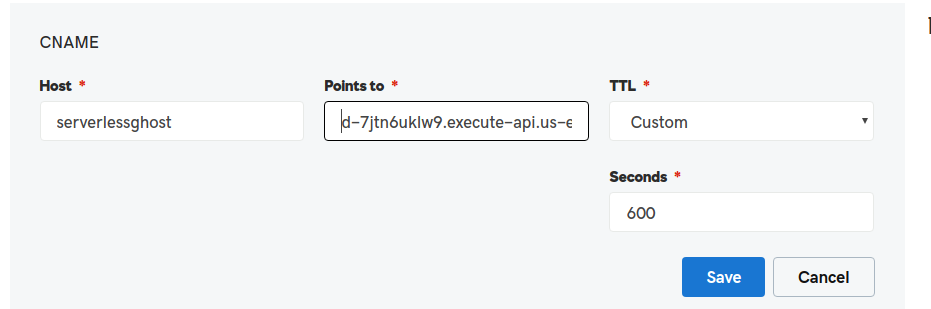

## Cold start
After first deployment, we need to let Ghost do its initialisation, e.g copy themes and populate the database. To do so, hit the ping url given in the cfn output,

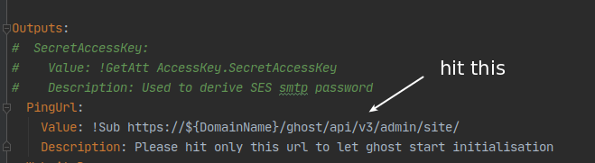

e.g run

`curl  https://ghost.johnnyserverless.com/ghost/api/v3/admin/site/`

Give it about 1 minute to run __even__ if the request times out. Initialisation is still going on.
Try again in a few seconds.
When all is done, you should be able to use the blog properly at your configured domain:

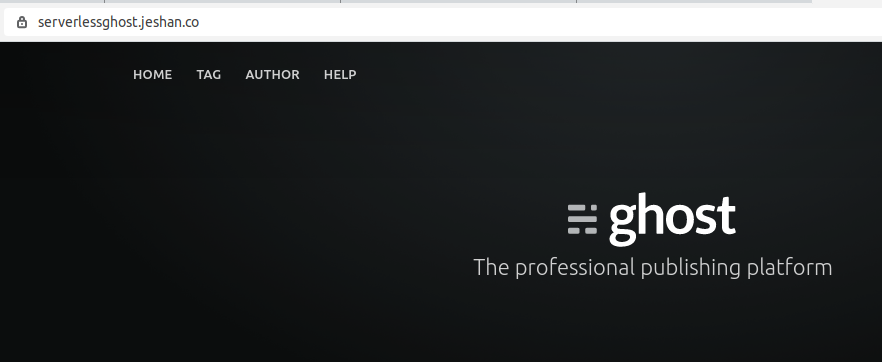

## Additional deployment instructions
> I've tried to optimise the defaults for fast stack creation and/or create cheap resources. The process is not designed to be as flexible as possible. e.g allocating specific amount of storage is not parameterised. You need to modify the [template.yaml](template.yaml) if you want more specific customisations.

To change the AWS CLI profile, edit the `AWS_PROFILE` variable in [.env](.env).

### Internet access
You will need a NAT gateway for outbound traffic, e.g for Ghost to send forgot password emails. Since NAT gateways are expensive to run, the default here is to not create it. To do so, set the `EnableNat` parameter to be `true`. 

### Emails
`serverless-ghost` provides out-of-the-box support for email (only) via Amazon SES.
To enable SES, you need to provide `SesSmtpPassword`. You need to generate that password from the created IAM user's secret access key.
- Uncomment the `SecretAccessKey` [template](template.yaml) output here:

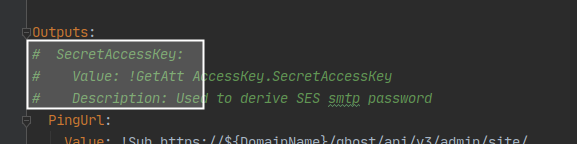
- Redeploy the stack to get the said value: `docker-compose up --build deploy`
- Paste that value in [.env](.env) here:

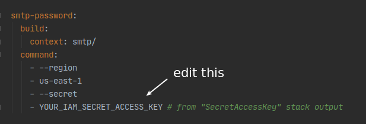
- Run `docker-compose up smtp-password`
- Check the output for the smtp password:

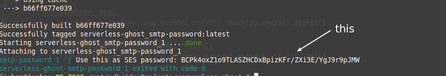
- Put this value as `SesSmtpPassword` parameter

- Redeploy the stack so that Ghost can get the password: `docker-compose up --build deploy`

> If for some reason you can't use the above procedure, consult the AWS docs about [Obtaining Your Amazon SES SMTP Credentials](https://docs.aws.amazon.com/ses/latest/DeveloperGuide/smtp-credentials.html).

### Other parameters
- `DatabasePassword`: Ghost will use this master user's password in the current setup to simplify deployment. Please set a more reasonable one than the default!
- `EnableDebugLogs`: ensure it's true so that you can attach the logs when investigating issues.
- `SentryDsn`: If you like to [use Sentry](https://sentry.io/welcome) for error monitoring, provide the DSN from a Sentry project.
- `Memory`: Number of megabytes to allocate to the serverless function. It will mostly help just to reduce cold start times.
- `UseServerlessDb`: Uses an Aurora serverless database if `true`. Otherwise, it uses an RDS Mysql `db.t3.micro`

> Feel free to edit [template.yaml](template.yaml) for more flexibility.

Deployment tested in us-east-1. Let me know if otherwise there are any issues.

### Additional features
#### Static site
You can generate a static site out of your Ghost site with a project like [ghost-static-site-generator](https://github.com/Fried-Chicken/ghost-static-site-generator).
Set your ghost home page and new static site home page in [.env](.env) as shown here:

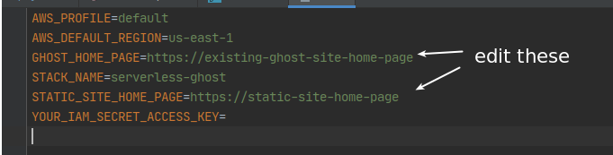

You can easily do this for your site by running `docker-compose up static-site`. This will generate a folder with the static website contents in the docker container and serve it at http://localhost:8080

For more options, check out its home page at https://github.com/Fried-Chicken/ghost-static-site-generator .

# Caveats
> Please remember that Ghost is [**meant to be always running**](https://forum.ghost.org/t/serverless-ghost/6318/2) so we probably won't be able to leverage all features with `serverless-ghost`. If there are any issues, please raise them.

Some Ghost background processes may need to be run but are paused by Lambda when no invocations are occurring. If no invocations are coming, then it's unclear how Ghost will handle such situations.
Taking the above in consideration, note that:

- If changing themes, give it a few seconds to take effect. (I think this is how Ghost normally works anyway). You will see a "site starting up" message when accessing the website.
- If you see an error "Knex: Timeout acquiring a connection. The pool is probably full. Are you missing a .transacting(trx) call?" when the database has just booted, a workaround is force Lambda to recreate a container by e.g updating the function configuration.
- If you're seeing an "internal server error" and you're seeing a ghost migration issue in the Lambda logs, then this is because the serverless function has been hit too many times while still initialising the database.
You can work around it by running the query `update migrations_lock set locked = false, released_at = curdate();`.
> As at now, only Aurora Serverless allows to run queries via the api/console.
- To tail/get the Lambda logs, run `docker-compose up logs`
